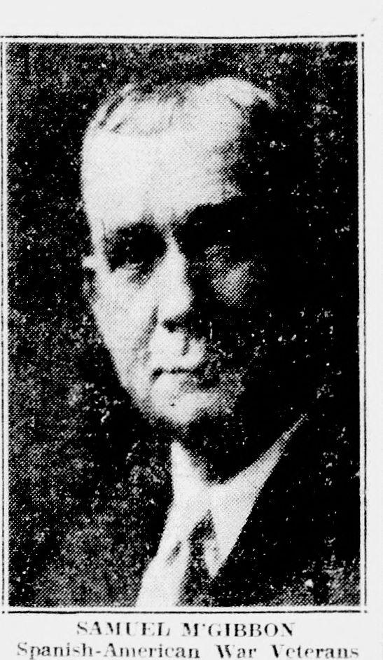

# Day 2: Doing a computer vision project

##  Aims:

- The goal today is to go through ~~all~~ many of the steps of doing a computer vision project focused on a humanities research question.
- Tis day will be less structured than day one and may change depending on the interests of participants.
- We ~~will~~ may end up with:
  - a training dataset
  - a trained model

##  What does a computer vision project look like?

###  What is our question?

To explore some of the steps involved in creating a computer vision project we will make up a research question/topic:

> How does the number of people appearing in photographs change over time in (mostly) US newspapers?

### Do we need to use machine learning?

### Do we need to create a model?

- using commercial services?
- model hubs
- finding existing models.
- test an existing model?

### Creating training data (simple approach)

This is often seen as the most boring part of machine learning but it's both important and potentially an interesting and challenging area to explore. 

Notebook

### Creating training data
- Annotation platforms
- Zooniverse 

