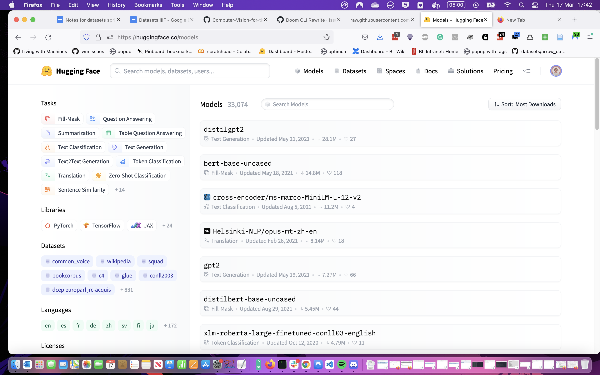

# Day 2: Doing a computer vision project

##  Aims:

- The goal today is to go through ~~all~~ many of the steps of doing a computer vision project focused on a humanities research question.
- Tis day will be less structured than day one and may change depending on the interests of participants.
- We ~~will~~ may end up with:
  - a training dataset
  - a trained model

# Practical steps

##  What does a computer vision project look like?

###  What is our question?

### Do we need to use machine learning?

### Do we need to create a model?

- using commercial services?
- model hubs
- finding existing models.
- test an existing model?

## Exploring vision API services

> - Explore the predictions made by the [Google Cloud Vision](https://cloud.google.com/vision) API service or [Azure Computer Vision](https://azure.microsoft.com/en-gb/services/cognitive-services/computer-vision/#features) API with some historic images
> - Look at the labels this API predicts for your image. 
> - How might these labels be useful?
> - Are there any problems with the labels shown?
> - Can you find a list of possible labels that this service could predict for an image?

## Model hubs

## A more specific model: trying out a YOLO model

### Creating training data (simple approach)

### Creating training data (without much annotation)

### Creating training data
- Annotation platforms
- Zooniverse 

## How to share data
Datasheets for datasets

## How to share our model 

## Other topics

# Image similarity 
https://www.sbert.net/examples/applications/image-search/README.html
https://colab.research.google.com/drive/1wLiZNedMwlM-FxBVbp3aA353yohV_wJ1?usp=sharing

### Image Clustering

https://github.com/UKPLab/sentence-transformers/tree/master/examples/applications/image-search/Image_Clustering.ipynb

